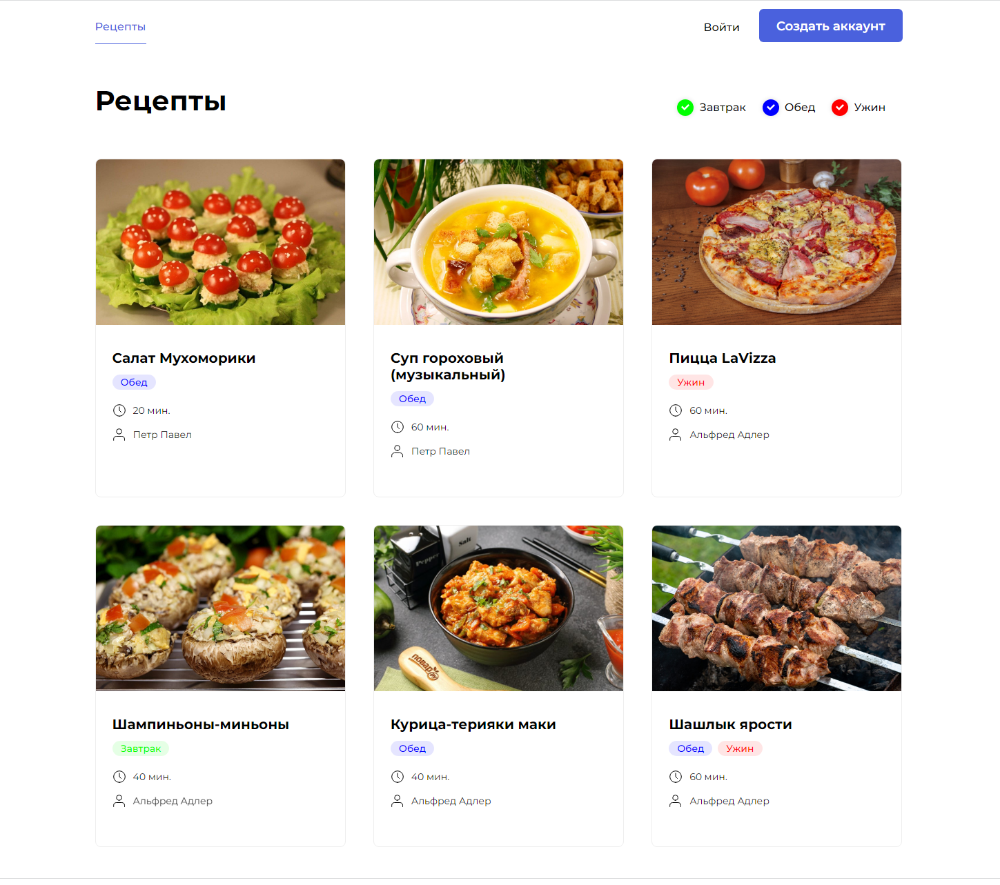

# Проект "Продуктовый помощник (Foodgram)"


## Описание проекта
- Проект «Продуктовый помощник»: это приложение, в котором пользователи могут публиковать рецепты, подписываться на публикации других авторов и добавлять рецепты в избранное. 
- Сервис «Список покупок» позволит пользователю создавать список продуктов, которые нужно купить для приготовления выбранных блюд.

<details>
  <summary>Фото проекта</summary>
  
</details>

## Использованные технологии:

- Django 3.2.9
- Python 3.9.10
- Django Rest Framework 3.12.4
- PostgreSQL
- Nginx
- Gunicorn
- Authtoken
- Docker
- Docker-compose
- GitHub Actions
- Cервер Linux Ubuntu 20.04

## Запуск проекта

Установить docker, docker-compose на сервер ВМ Yandex.Cloud:
```
ssh <login>@<ip>
```
```
sudo apt update && sudo apt upgrade -y && sudo apt install curl -y
```
```
sudo curl -fsSL https://get.docker.com -o get-docker.sh && sudo sh get-docker.sh && sudo rm get-docker.sh
```
```
sudo curl -L "https://github.com/docker/compose/releases/download/1.29.2/docker-compose-$(uname -s)-$(uname -m)" -o /usr/local/bin/docker-compose
```
```
sudo chmod +x /usr/local/bin/docker-compose
```

- Перенести файлы docker-compose.yml и default.conf на сервер.

```
scp docker-compose.yml username@server_ip:/home/<username>/
```
```
scp default.conf <username>@<server_ip>:/home/<username>/
```
- Создать файл .env в дериктории infra:

```
touch .env
```
- Заполнить в настройках своего репозитория secrets:

```python
DB_ENGINE=<указываем тип БД default='django.db.backends.postgresql'>
DB_NAME=<имя базы данных>
POSTGRES_USER=<логин для подключения к базе данных>
POSTGRES_PASSWORD=<пароль для подключения к БД (установите свой)>
DB_HOST=<название сервиса (контейнера)>
DB_PORT=<порт для подключения к БД>
```

Для доступа к контейнеру выполнить следующие команды:

```
sudo docker compose exec backend python manage.py makemigrations
```
```
sudo docker compose exec backend python manage.py migrate --noinput
```
```
sudo docker compose exec backend python manage.py createsuperuser
```
```
sudo docker compose exec backend python manage.py collectstatic --no-input
```

Дополнительно можно наполнить базу данных ингредиентами:

```
sudo docker compose exec backend python manage.py load_ingredient_csv
```

### Настроен Workflow, который состоит из четырех шагов:
- Проверка кода на соответствие PEP8
- Сборка и публикация образа бекенда на DockerHub
- Автоматический деплой на удаленный сервер
- Отправка уведомления в телеграм-чат

Проект развернут по адресу: [84.201.164.176](http://84.201.164.176)
- Логин: admin
- Email: admin@admin.ru
- Пароль: admin

<h3> Автор проекта</h3>
[Александр Санычев](https://github.com/Saborrr)
